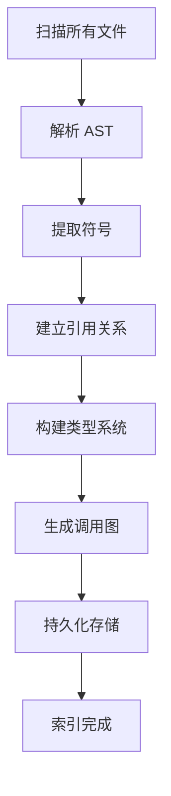
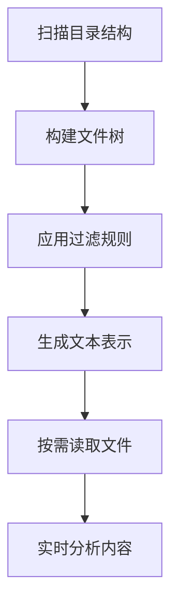

# 索引化基础原理

## 什么是代码库索引化？

代码库索引化（Codebase Indexing）是现代 AI 编程工具的核心技术之一，它指的是**对整个代码库进行结构化分析、组织和存储，以支持快速检索、理解和操作**的过程。

### 传统意义的索引化

在传统的软件开发工具中，索引化主要服务于以下功能：
- **语法高亮**：识别关键字、变量、函数等
- **代码补全**：基于当前上下文提供候选项
- **跳转定义**：快速定位符号的定义位置
- **查找引用**：找到符号被使用的所有位置
- **重构支持**：安全地重命名、移动代码

### AI 时代的索引化革命

AI 编程工具的索引化需求发生了根本性变化：

#### 1. 从符号级到语义级
```
传统 IDE：function getName() { ... }  →  符号表中记录 "getName 是一个函数"
AI 工具：  function getName() { ... }  →  "这是一个获取用户姓名的函数，用于用户信息管理"
```

#### 2. 从局部到全局
```
传统 IDE：关注当前文件或模块的符号关系
AI 工具：  需要理解整个项目的架构、模式、约定
```

#### 3. 从静态到动态
```
传统 IDE：一次性建立索引，增量更新
AI 工具：  根据用户意图动态构建不同粒度的上下文
```

## Void 的索引化设计哲学

### 核心理念：轻量级 + 实时性

Void 采用了一种独特的索引化策略，与传统 IDE 的"重索引"模式形成鲜明对比：

```typescript
// 传统 IDE 的索引化模式
class TraditionalIndexer {
  // 1. 完整扫描所有文件
  // 2. 构建完整的符号表
  // 3. 建立复杂的引用关系
  // 4. 存储在持久化存储中
  async buildFullIndex() {
    for (const file of allFiles) {
      const ast = parse(file);
      const symbols = extractSymbols(ast);
      this.symbolTable.store(symbols);
      this.buildReferences(symbols);
    }
  }
}

// Void 的索引化模式
class VoidIndexer {
  // 1. 轻量级目录结构索引
  // 2. 按需文件内容分析
  // 3. 实时构建上下文
  async buildLightweightIndex() {
    // 只构建文件系统结构，不解析文件内容
    const structure = await this.buildDirectoryTree();
    // 根据 AI 查询需求，动态分析相关文件
    return structure;
  }
}
```

### 设计原则

#### 1. **延迟加载（Lazy Loading）**
```typescript
// 不是预先解析所有文件
async getFileContent(uri: URI) {
  // 只在需要时读取和分析
  if (!this.cache.has(uri)) {
    const content = await this.fileService.readFile(uri);
    this.cache.set(uri, content);
  }
  return this.cache.get(uri);
}
```

#### 2. **智能优先级（Smart Prioritization）**
```typescript
function prioritizeFiles(files: FileInfo[]): FileInfo[] {
  return files.sort((a, b) => {
    // 配置文件优先
    if (isConfigFile(a) && !isConfigFile(b)) return -1;
    // 根目录文件优先
    if (isRootLevel(a) && !isRootLevel(b)) return -1;
    // 小文件优先（快速处理）
    if (a.size < b.size) return -1;
    return 0;
  });
}
```

#### 3. **渐进式揭示（Progressive Disclosure）**
```typescript
// 分层次提供信息
interface LayeredIndex {
  level1: DirectoryStructure;    // 文件系统结构
  level2: FileMetadata;          // 文件元数据
  level3: ContentPreview;        // 内容预览
  level4: DetailedAnalysis;      // 详细分析
}
```

## 与传统 IDE 索引的技术对比

### 数据结构差异

#### 传统 IDE 索引
```typescript
interface TraditionalIndex {
  symbolTable: Map<string, SymbolInfo>;      // 完整符号表
  referenceGraph: Graph<Symbol, Reference>;  // 引用关系图
  typeHierarchy: Tree<Type>;                 // 类型层次结构
  callGraph: Graph<Function, Call>;          // 调用关系图
}

class SymbolInfo {
  name: string;
  type: SymbolType;
  location: Location;
  scope: Scope;
  modifiers: Modifier[];
  documentation: string;
  references: Reference[];
}
```

#### Void 的轻量化索引
```typescript
interface VoidIndex {
  directoryTree: DirectoryNode;     // 目录树结构
  fileMetadata: Map<URI, FileMeta>; // 文件元数据
  // 没有预建的符号表、引用图等重型结构
}

class DirectoryNode {
  name: string;
  path: string;
  type: 'file' | 'directory';
  children?: DirectoryNode[];
  size?: number;
  isSymbolicLink?: boolean;
  // 注意：没有内容分析结果
}
```

### 构建过程对比

#### 传统 IDE 的索引构建


**特点：**
- 重型启动：需要完整扫描所有文件
- 高内存占用：维护完整的符号表和关系图
- 持久化存储：索引结果保存到磁盘
- 增量更新：文件变化时更新相关部分

#### Void 的索引构建


**特点：**
- 轻量启动：只扫描文件系统结构
- 低内存占用：不维护复杂的符号关系
- 内存存储：结果保存在内存中
- 实时构建：根据需求动态分析

## AI 代码生成中的索引化作用

### 上下文构建

AI 代码生成的质量很大程度上取决于**上下文的质量和相关性**。索引化在其中扮演关键角色：

#### 1. **相关文件发现**
```typescript
// 基于文件名和路径的智能匹配
async findRelevantFiles(query: string): Promise<URI[]> {
  const candidates = await this.getAllFiles();
  
  return candidates.filter(file => {
    // 文件名匹配
    if (file.name.toLowerCase().includes(query.toLowerCase())) return true;
    
    // 路径相关性
    if (this.isPathRelevant(file.path, query)) return true;
    
    // 文件类型相关性
    if (this.isTypeRelevant(file.extension, query)) return true;
    
    return false;
  }).sort(by => this.calculateRelevanceScore(file, query));
}
```

#### 2. **项目结构理解**
```typescript
// 为 LLM 提供项目结构的文本表示
function generateProjectContext(rootUri: URI): string {
  const tree = await this.directoryService.getDirectoryTree(rootUri);
  
  return `
项目结构：
/project/
  ├── src/
  │   ├── components/
  │   │   ├── Button.tsx
  │   │   └── Input.tsx
  │   ├── utils/
  │   │   └── helpers.ts
  │   └── index.ts
  ├── tests/
  │   └── components/
  │       └── Button.test.tsx
  └── package.json
  
这是一个 React + TypeScript 项目，包含组件库和测试。
`;
}
```

#### 3. **代码模式识别**
```typescript
// 通过索引化信息识别项目中的常见模式
class ProjectPatternAnalyzer {
  async analyzePatterns(directoryTree: DirectoryNode): Promise<ProjectPattern[]> {
    const patterns = [];
    
    // 识别框架类型
    if (this.hasFile(tree, 'package.json')) {
      const pkg = await this.readPackageJson();
      if (pkg.dependencies['react']) patterns.push('React项目');
      if (pkg.dependencies['vue']) patterns.push('Vue项目');
    }
    
    // 识别架构模式
    if (this.hasDirectory(tree, 'components')) patterns.push('组件化架构');
    if (this.hasDirectory(tree, 'services')) patterns.push('服务层架构');
    
    // 识别测试策略
    if (this.hasDirectory(tree, 'tests') || this.hasDirectory(tree, '__tests__')) {
      patterns.push('单元测试');
    }
    
    return patterns;
  }
}
```

### 智能代码补全

基于项目索引的代码补全比传统的符号级补全更加智能：

#### 传统补全 vs AI 补全

```typescript
// 传统补全：基于当前作用域的符号
function traditionalCompletion(currentScope: Scope) {
  // 只考虑当前可见的符号
  return currentScope.getVisibleSymbols();
}

// AI 补全：基于项目上下文和意图理解
async function aiCompletion(
  currentPosition: Position,
  projectContext: ProjectContext,
  userIntent: string
) {
  // 1. 理解当前代码上下文
  const localContext = await analyzeLocalContext(currentPosition);
  
  // 2. 根据项目模式推断可能的补全
  const projectPatterns = await analyzeProjectPatterns();
  
  // 3. 基于用户意图生成补全建议
  const suggestions = await generateSuggestions({
    local: localContext,
    project: projectContext,
    patterns: projectPatterns,
    intent: userIntent
  });
  
  return suggestions;
}
```

## 技术挑战与解决方案

### 挑战 1：大型项目的性能问题

**问题：** 大型项目可能包含数十万个文件，如何快速构建索引？

**Void 的解决方案：**
```typescript
// 分层构建策略
class LayeredIndexBuilder {
  async buildIndex(rootUri: URI) {
    // 第一层：只遍历顶级目录（快速）
    const topLevel = await this.buildTopLevelStructure(rootUri);
    
    // 第二层：按需深入重要目录（中等速度）
    const importantDirs = this.identifyImportantDirectories(topLevel);
    await this.buildMediumDepthIndex(importantDirs);
    
    // 第三层：用户请求时才深入分析（按需）
    // 不预先构建，完全按需
  }
}
```

### 挑战 2：内存占用控制

**问题：** 避免像传统 IDE 那样占用大量内存

**Void 的解决方案：**
```typescript
// 智能缓存策略
class SmartCache {
  private cache = new Map<string, CacheEntry>();
  private readonly MAX_CACHE_SIZE = 100 * 1024 * 1024; // 100MB
  
  async get(key: string): Promise<any> {
    // LRU 淘汰策略
    if (this.cache.has(key)) {
      const entry = this.cache.get(key)!;
      entry.lastAccess = Date.now();
      return entry.data;
    }
    
    // 检查缓存大小，必要时清理
    if (this.getCurrentSize() > this.MAX_CACHE_SIZE) {
      this.evictLeastRecentlyUsed();
    }
    
    // 加载数据
    const data = await this.loadData(key);
    this.cache.set(key, { data, lastAccess: Date.now() });
    return data;
  }
}
```

### 挑战 3：实时性要求

**问题：** 用户操作需要立即响应，不能等待索引构建完成

**Void 的解决方案：**
```typescript
// 渐进式响应策略
class ProgressiveResponseService {
  async handleUserQuery(query: string) {
    // 立即返回基础结果
    const basicResults = await this.getBasicResults(query);
    this.sendPartialResponse(basicResults);
    
    // 后台继续深化分析
    const detailedResults = await this.getDetailedResults(query);
    this.sendEnhancedResponse(detailedResults);
    
    // 如果需要，进行完整分析
    if (this.needsFullAnalysis(query)) {
      const fullResults = await this.getFullResults(query);
      this.sendFinalResponse(fullResults);
    }
  }
}
```

## 小结

Void 的索引化设计体现了 AI 时代编程工具的新思路：

1. **轻量化**：不预先构建重型索引，按需分析
2. **智能化**：基于 AI 理解能力，从符号级上升到语义级
3. **实时性**：快速响应用户需求，渐进式提供结果
4. **上下文化**：为 AI 模型提供丰富的项目上下文

这种设计使得 Void 能够在保持高性能的同时，为 AI 代码生成提供高质量的上下文信息，是传统 IDE 索引化技术的重要演进。

下一章我们将深入分析 Void 的具体实现架构，包括 DirectoryStrService 的详细设计和实现细节。 