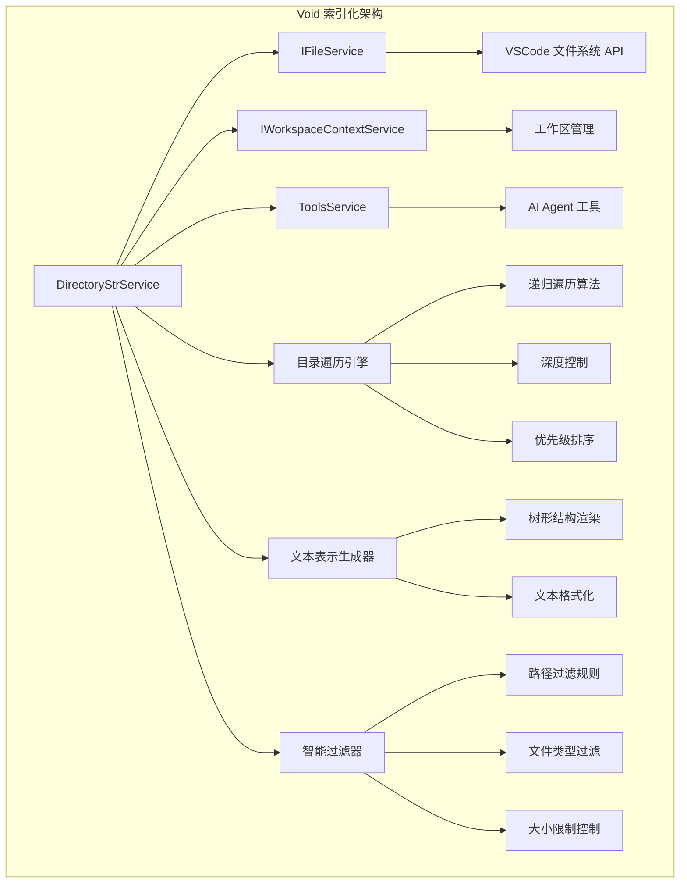

# Void 架构深度解析

## 核心架构概览

Void 的索引化架构建立在 VSCode 的基础之上，通过 `DirectoryStrService` 作为核心服务，配合文件服务和工作区服务，构建了一个轻量级但功能强大的代码库索引系统。

### 关键组件架构图



## DirectoryStrService 深度解析

### 接口设计哲学

`IDirectoryStrService` 接口的设计体现了"简单而强大"的理念：

```typescript
export interface IDirectoryStrService {
  readonly _serviceBrand: undefined;

  // 核心方法：获取单个目录的文本表示
  getDirectoryStrTool(uri: URI): Promise<string>
  
  // 全局方法：获取所有工作区目录的文本表示
  getAllDirectoriesStr(opts: { cutOffMessage: string }): Promise<string>

  // 辅助方法：获取目录中的所有文件 URI
  getAllURIsInDirectory(uri: URI, opts: { maxResults: number }): Promise<URI[]>
}
```

**设计亮点：**

1. **最小化 API 表面**：只暴露 3 个核心方法，降低复杂性
2. **面向 AI 优化**：方法名和返回类型专门为 LLM 消费优化
3. **可配置性**：通过 `opts` 参数提供灵活的配置选项
4. **异步设计**：所有方法都是异步的，支持大型项目处理

### 核心常量配置

```typescript
const MAX_FILES_TOTAL = 1000;  // 最大文件数限制

// 自适应深度控制
const START_MAX_DEPTH = Infinity;     // 初始尝试：无深度限制
const START_MAX_ITEMS_PER_DIR = Infinity;  // 初始尝试：无数量限制

const DEFAULT_MAX_DEPTH = 3;          // 后备方案：3层深度
const DEFAULT_MAX_ITEMS_PER_DIR = 3;  // 后备方案：每目录3个项目
```

**智能退化策略：**
- 首先尝试构建完整索引（`Infinity` 限制）
- 如果结果被截断，自动降级到保守策略（3层深度，每层3项）
- 确保在任何情况下都能提供有用的结果

### 智能过滤系统

#### 目录过滤规则

```typescript
const shouldExcludeDirectory = (name: string) => {
  // 硬编码的常见排除目录
  if (name === '.git' ||
      name === 'node_modules' ||
      name.startsWith('.') ||
      name === 'dist' ||
      name === 'build' ||
      name === 'out' ||
      name === 'bin' ||
      name === 'coverage' ||
      name === '__pycache__' ||
      name === 'env' ||
      name === 'venv' ||
      name === 'tmp' ||
      name === 'temp' ||
      name === 'artifacts' ||
      name === 'target' ||
      name === 'obj' ||
      name === 'vendor' ||
      name === 'logs' ||
      name === 'cache' ||
      name === 'resource' ||
      name === 'resources'
  ) {
    return true;
  }

  // 正则匹配模式
  if (name.match(/\bout\b/)) return true
  if (name.match(/\bbuild\b/)) return true

  return false;
}
```

**过滤策略分析：**

1. **覆盖主流技术栈**：
   - JavaScript/Node.js: `node_modules`, `dist`, `build`
   - Python: `__pycache__`, `env`, `venv`
   - Java/C#: `target`, `obj`, `bin`
   - 通用: `.git`, `tmp`, `cache`

2. **性能优先**：排除大型目录避免遍历开销

3. **用户体验**：过滤掉对 AI 理解代码库无用的目录

## 分层索引实现

### 浅层索引：`computeDirectoryTree1Deep`

```typescript
export const computeDirectoryTree1Deep = async (
  fileService: IFileService,
  rootURI: URI,
  pageNumber: number = 1,
): Promise<BuiltinToolResultType['ls_dir']> => {
  const stat = await fileService.resolve(rootURI, { resolveMetadata: false });
  if (!stat.isDirectory) {
    return { children: null, hasNextPage: false, hasPrevPage: false, itemsRemaining: 0 };
  }

  const nChildren = stat.children?.length ?? 0;

  // 分页逻辑
  const fromChildIdx = MAX_CHILDREN_URIs_PAGE * (pageNumber - 1);
  const toChildIdx = MAX_CHILDREN_URIs_PAGE * pageNumber - 1; // INCLUSIVE
  const listChildren = stat.children?.slice(fromChildIdx, toChildIdx + 1);

  const children: ShallowDirectoryItem[] = listChildren?.map(child => ({
    name: child.name,
    uri: child.resource,
    isDirectory: child.isDirectory,
    isSymbolicLink: child.isSymbolicLink
  })) ?? [];

  const hasNextPage = (nChildren - 1) > toChildIdx;
  const hasPrevPage = pageNumber > 1;
  const itemsRemaining = Math.max(0, nChildren - (toChildIdx + 1));

  return { children, hasNextPage, hasPrevPage, itemsRemaining };
}
```

**设计特点：**

1. **分页支持**：处理大型目录时避免一次性加载过多内容
2. **轻量级元数据**：只获取基本文件信息，不读取文件内容
3. **状态追踪**：提供分页状态信息（是否有下一页、剩余项目数等）

### 深层索引：自适应策略

#### 第一阶段：乐观尝试

```typescript
// 在 getDirectoryStrTool 中的实现
const maxItemsPerDir = START_MAX_ITEMS_PER_DIR; // Infinity

const { content: initialContent, wasCutOff: initialCutOff } = await computeAndStringifyDirectoryTree(
  eRoot,
  this.fileService,
  MAX_DIRSTR_CHARS_TOTAL_TOOL,
  { count: 0 },
  { maxDepth: START_MAX_DEPTH, currentDepth: 0, maxItemsPerDir }
);
```

#### 第二阶段：保守降级

```typescript
// 如果第一次尝试被截断，使用保守策略
if (initialCutOff) {
  const result = await computeAndStringifyDirectoryTree(
    eRoot,
    this.fileService,
    MAX_DIRSTR_CHARS_TOTAL_TOOL,
    { count: 0 },
    { maxDepth: DEFAULT_MAX_DEPTH, currentDepth: 0, maxItemsPerDir: DEFAULT_MAX_ITEMS_PER_DIR }
  );
  content = result.content;
  wasCutOff = result.wasCutOff;
}
```

## 树形结构渲染引擎

### 核心算法：`renderChildrenCombined`

这是 Void 索引系统的核心算法，负责将文件系统结构转换为 AI 可理解的文本表示：

```typescript
const renderChildrenCombined = async (
  children: IFileStat[],
  maxChars: number,
  parentPrefix: string,
  fileService: IFileService,
  fileCount: { count: number },
  options: { maxDepth: number, currentDepth: number, maxItemsPerDir?: number }
): Promise<{ childrenContent: string, childrenCutOff: boolean }> => {
  const { maxDepth, currentDepth } = options;
  
  // 智能深度控制：第一层永远使用 Infinity
  const maxItemsPerDir = currentDepth === 0 ?
    Infinity :
    (options.maxItemsPerDir ?? DEFAULT_MAX_ITEMS_PER_DIR);
    
  const nextDepth = currentDepth + 1;

  let childrenContent = '';
  let childrenCutOff = false;
  let remainingChars = maxChars;

  // 深度限制检查
  if (nextDepth > maxDepth) {
    return { childrenContent: '', childrenCutOff: true };
  }

  // 应用数量限制
  const itemsToProcess = maxItemsPerDir === Infinity ? children : children.slice(0, maxItemsPerDir);
  const hasMoreItems = children.length > itemsToProcess.length;

  // 遍历处理每个子项
  for (let i = 0; i < itemsToProcess.length; i++) {
    // 文件数量限制检查
    if (fileCount.count >= MAX_FILES_TOTAL) {
      childrenCutOff = true;
      break;
    }

    const child = itemsToProcess[i];
    const isLast = (i === itemsToProcess.length - 1) && !hasMoreItems;

    // 生成树形结构的视觉表示
    const branchSymbol = isLast ? '└── ' : '├── ';
    const childLine = `${parentPrefix}${branchSymbol}${child.name}${child.isDirectory ? '/' : ''}${child.isSymbolicLink ? ' (symbolic link)' : ''}\n`;

    // 字符限制检查
    if (childLine.length > remainingChars) {
      childrenCutOff = true;
      break;
    }

    childrenContent += childLine;
    remainingChars -= childLine.length;
    fileCount.count++;

    const nextLevelPrefix = parentPrefix + (isLast ? '    ' : '│   ');

    // 递归处理子目录
    if (child.isDirectory && !shouldExcludeDirectory(child.name)) {
      const eChildren = await resolveChildren(child.children, fileService)

      if (eChildren && eChildren.length > 0) {
        const {
          childrenContent: grandChildrenContent,
          childrenCutOff: grandChildrenCutOff
        } = await renderChildrenCombined(
          eChildren,
          remainingChars,
          nextLevelPrefix,
          fileService,
          fileCount,
          { maxDepth, currentDepth: nextDepth, maxItemsPerDir }
        );

        if (grandChildrenContent.length > 0) {
          childrenContent += grandChildrenContent;
          remainingChars -= grandChildrenContent.length;
        }

        if (grandChildrenCutOff) {
          childrenCutOff = true;
        }
      }
    }
  }

  // 截断提示
  if (hasMoreItems) {
    const remainingCount = children.length - itemsToProcess.length;
    const truncatedLine = `${parentPrefix}└── (${remainingCount} more items not shown...)\n`;

    if (truncatedLine.length <= remainingChars) {
      childrenContent += truncatedLine;
      remainingChars -= truncatedLine.length;
    }
    childrenCutOff = true;
  }

  return { childrenContent, childrenCutOff };
};
```

### 渲染算法的创新点

#### 1. **多层限制控制**

```typescript
// 不同层级应用不同的限制策略
const maxItemsPerDir = currentDepth === 0 ?
  Infinity :  // 第一层：不限制，展示完整的顶级结构
  (options.maxItemsPerDir ?? DEFAULT_MAX_ITEMS_PER_DIR);  // 深层：应用限制
```

**设计思路：**
- 第一层（项目根目录）：完整展示所有顶级文件和目录
- 深层目录：应用限制避免信息爆炸

#### 2. **精确的字符控制**

```typescript
// 实时跟踪剩余字符数
if (childLine.length > remainingChars) {
  childrenCutOff = true;
  break;
}

childrenContent += childLine;
remainingChars -= childLine.length;
```

**优势：**
- 确保输出不超过 LLM 的上下文限制
- 在接近限制时优雅地截断

#### 3. **视觉友好的树形表示**

```typescript
// 生成类似 Unix tree 命令的输出
const branchSymbol = isLast ? '└── ' : '├── ';
const nextLevelPrefix = parentPrefix + (isLast ? '    ' : '│   ');
```

**生成的效果：**
```
project/
├── src/
│   ├── components/
│   │   ├── Button.tsx
│   │   └── Input.tsx
│   └── utils/
│       └── helpers.ts
├── tests/
│   └── Button.test.tsx
└── package.json
```

## 性能优化策略

### 1. 文件解析延迟

```typescript
const eChildren = await resolveChildren(child.children, fileService)
```

`resolveChildren` 函数只在需要时才解析子目录内容，而不是预先加载所有文件信息。

### 2. 智能缓存（推断实现）

虽然当前代码中没有显式的缓存，但 VSCode 的文件系统服务本身提供了缓存机制：

```typescript
// VSCode 的 IFileService 内部实现了缓存
const stat = await fileService.resolve(rootURI, { resolveMetadata: false });
```

### 3. 并发控制

通过文件数量限制（`MAX_FILES_TOTAL = 1000`）和字符数限制防止过度处理：

```typescript
// 文件数量控制
if (fileCount.count >= MAX_FILES_TOTAL) {
  childrenCutOff = true;
  break;
}

// 字符数控制
if (childLine.length > remainingChars) {
  childrenCutOff = true;
  break;
}
```

## 多工作区支持

### 工作区遍历策略

```typescript
async getAllDirectoriesStr({ cutOffMessage }: { cutOffMessage: string }) {
  let str: string = '';
  let cutOff = false;
  const folders = this.workspaceContextService.getWorkspace().folders;
  
  if (folders.length === 0)
    return '(NO WORKSPACE OPEN)';

  // 按顺序处理每个工作区文件夹
  for (let i = 0; i < folders.length; i += 1) {
    if (i > 0) str += '\n';

    // 优先级策略：填满第一个工作区再处理下一个
    const f = folders[i];
    str += `Directory of ${f.uri.fsPath}:\n`;
    
    // ... 处理单个工作区的逻辑
    
    if (wasCutOff) {
      cutOff = true;
      break; // 如果当前工作区就被截断，停止处理后续工作区
    }
  }

  return cutOff ? `${str.trimEnd()}\n${cutOffMessage}` : str
}
```

**多工作区策略特点：**

1. **优先级处理**：按工作区顺序处理，优先填满第一个工作区
2. **早期截断**：如果第一个工作区就超出限制，不处理后续工作区
3. **清晰分隔**：不同工作区之间用换行分隔
4. **路径显示**：显示每个工作区的完整路径

## 文本输出格式化

### 输出模板

```typescript
// 单目录工具的输出格式
let c = content.substring(0, MAX_DIRSTR_CHARS_TOTAL_TOOL)
c = `Directory of ${uri.fsPath}:\n${content}`
if (wasCutOff) c = `${c}\n...Result was truncated...`

return c
```

**格式特点：**

1. **标准化头部**：`Directory of /path/to/directory:`
2. **截断提示**：明确告知用户结果被截断
3. **字符限制**：严格控制在预设的字符限制内

### 截断消息处理

```typescript
const ans = cutOff ? `${str.trimEnd()}\n${cutOffMessage}` : str
```

允许调用者自定义截断消息，提供更好的用户体验。

## 与 AI Agent 的集成

### 工具服务集成

Void 的 `DirectoryStrService` 通过 `ToolsService` 与 AI Agent 集成：

```typescript
// 在 ToolsService 中的调用
const str = await this.directoryStrService.getDirectoryStrTool(uri)
```

### LLM 友好的输出格式

输出格式专门为 LLM 消费优化：

1. **结构化**：使用统一的树形结构表示
2. **简洁**：只包含必要信息（文件名、目录标识、符号链接标识）
3. **可解析**：LLM 可以轻松理解目录层次关系
4. **有界**：控制输出长度避免超出上下文限制

## 小结

Void 的 `DirectoryStrService` 实现展现了现代 AI 编程工具索引系统的精妙设计：

### 核心优势

1. **轻量级启动**：不需要预先构建复杂索引
2. **自适应策略**：根据项目大小动态调整处理策略
3. **智能过滤**：有效排除无关文件和目录
4. **多层限制**：字符数、文件数、深度等多维度控制
5. **LLM 优化**：输出格式专门为 AI 消费优化

### 技术创新

1. **双阶段处理**：乐观尝试 + 保守降级
2. **分层限制**：不同深度应用不同策略
3. **实时截断**：精确控制输出长度
4. **视觉友好**：类似 Unix tree 的输出格式

这种设计使得 Void 能够在保持高性能的同时，为 AI 模型提供高质量、结构化的代码库上下文信息，是传统重型索引系统的优雅替代方案。

下一章我们将深入分析具体的索引算法与数据结构实现细节。 