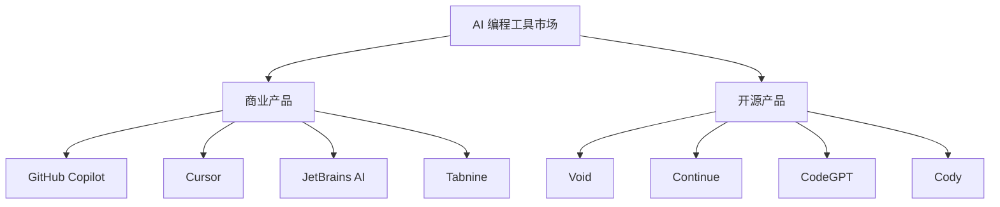

# 竞品对比分析

## AI 编程工具索引技术全景对比

本文深入对比分析主流 AI 编程工具的索引化技术，揭示不同产品的技术选择、架构差异和竞争优势。

### 市场格局概览



## 详细技术对比

### 🏆 GitHub Copilot

#### 技术架构特点
```typescript
class CopilotArchitecture {
  readonly approach = "云端大模型 + 轻量本地索引";
  
  indexingStrategy = {
    local: {
      scope: "当前文件 + 打开的文件",
      depth: "浅层符号表",
      realtime: "VSCode API 集成"
    },
    
    cloud: {
      scope: "GitHub 全量代码库",
      model: "Codex/GPT-4 预训练知识",
      context: "通过 prompt 注入"
    }
  };
  
  advantages = [
    "海量预训练数据",
    "强大的代码生成能力", 
    "VSCode 深度集成",
    "微软生态支持"
  ];
  
  limitations = [
    "需要网络连接",
    "隐私和安全顾虑",
    "本地上下文理解有限",
    "付费订阅模式"
  ];
}
```

#### 索引实现推测
```typescript
// 基于公开信息的技术推测
class CopilotIndexing {
  // 本地轻量级索引
  async buildLocalContext(activeFile: File): Promise<Context> {
    return {
      currentFile: await this.analyzeCurrentFile(activeFile),
      openFiles: await this.analyzeOpenFiles(),
      projectStructure: await this.getShallowProjectStructure(),
      recentEdits: this.getRecentEditHistory()
    };
  }
  
  // 云端上下文增强
  async enhanceWithCloudKnowledge(localContext: Context): Promise<EnhancedContext> {
    const similarProjects = await this.findSimilarProjects(localContext);
    const patterns = await this.extractCommonPatterns(similarProjects);
    
    return {
      ...localContext,
      cloudInsights: patterns,
      bestPractices: await this.getBestPractices(localContext.language)
    };
  }
}
```

### 🚀 Cursor

#### 技术特色分析
```typescript
class CursorArchitecture {
  readonly approach = "本地优先 + 云端增强";
  
  indexingInnovations = {
    codebaseChat: {
      feature: "与整个代码库对话",
      implementation: "可能使用向量数据库 + RAG",
      userExperience: "自然语言查询代码库"
    },
    
    contextualEditing: {
      feature: "上下文感知的代码编辑",
      implementation: "增强的本地索引 + 语义理解",
      userExperience: "智能代码建议和重构"
    },
    
    fileSearch: {
      feature: "语义文件搜索",
      implementation: "可能结合关键词 + 向量搜索",
      userExperience: "自然语言描述文件功能"
    }
  };
  
  competitiveAdvantages = [
    "更强的本地代码理解",
    "创新的 Chat with Codebase 功能",
    "更好的隐私保护",
    "快速的本地响应"
  ];
}
```

#### 推测的技术实现
```typescript
// 基于产品功能反推的可能实现
class CursorCodebaseChat {
  private vectorDB: VectorDatabase;
  private semanticChunker: SemanticChunker;
  
  async indexCodebase(projectPath: string): Promise<void> {
    // 1. 语义分块
    const files = await this.scanAllFiles(projectPath);
    const chunks = await this.semanticChunker.chunkFiles(files);
    
    // 2. 向量化
    const embeddings = await Promise.all(
      chunks.map(chunk => this.embedModel.encode(chunk))
    );
    
    // 3. 存储到向量数据库
    await this.vectorDB.bulkInsert(chunks, embeddings);
  }
  
  async chatWithCodebase(query: string): Promise<ChatResponse> {
    // 1. 检索相关代码片段
    const relevantChunks = await this.vectorDB.similaritySearch(query, 10);
    
    // 2. 构建上下文
    const context = this.buildChatContext(relevantChunks);
    
    // 3. 生成回答
    return await this.llm.chat(query, context);
  }
}
```

### 🔧 JetBrains AI

#### 独特优势分析
```typescript
class JetBrainsAIArchitecture {
  readonly approach = "深度 IDE 集成 + 成熟索引复用";
  
  coreAdvantages = {
    existingIndex: {
      asset: "20+ 年 IDE 索引技术积累",
      capabilities: [
        "完整的语法树分析",
        "类型系统理解", 
        "调用关系图",
        "重构支持"
      ]
    },
    
    languageSupport: {
      breadth: "50+ 编程语言深度支持",
      depth: "语言特定的智能感知",
      quality: "工业级的代码理解"
    },
    
    multiProject: {
      scope: "企业级多项目管理",
      sharing: "跨项目的知识共享",
      consistency: "统一的开发体验"
    }
  };
  
  aiIntegration = {
    strategy: "AI 增强现有功能",
    examples: [
      "智能代码补全",
      "AI 驱动的重构建议",
      "自动测试生成",
      "代码解释和文档生成"
    ]
  };
}
```

#### 技术实现优势
```typescript
class JetBrainsIndexingAdvantage {
  // 利用现有的强大索引系统
  async enhanceWithAI(existingIndex: IntelliJIndex): Promise<AIEnhancedIndex> {
    return {
      // 传统强项：精确的结构化信息
      structuralInfo: {
        symbolTable: existingIndex.symbolTable,
        callGraph: existingIndex.callGraph,
        typeHierarchy: existingIndex.typeHierarchy,
        usageIndex: existingIndex.usageIndex
      },
      
      // AI 增强：语义理解
      semanticLayer: {
        intentRecognition: await this.buildIntentModel(existingIndex),
        patternDetection: await this.detectPatterns(existingIndex),
        contextualSuggestions: await this.buildSuggestionModel(existingIndex)
      }
    };
  }
  
  // 企业级特性
  multiProjectIndexing = {
    sharedKnowledge: "跨项目的代码模式学习",
    teamLearning: "团队编码习惯分析",
    qualityInsights: "代码质量趋势分析"
  };
}
```

### 🌟 Void (开源领军)

#### 技术定位
```typescript
class VoidCompetitivePosition {
  readonly philosophy = "开源、透明、可自定义";
  
  technicalStrengths = {
    architecture: {
      benefit: "完全开源，架构透明",
      advantage: "开发者可以深度定制和扩展",
      impact: "社区驱动的快速迭代"
    },
    
    performance: {
      benefit: "轻量级设计，快速启动",
      advantage: "不依赖大型云端基础设施",
      impact: "适合个人开发者和小团队"
    },
    
    privacy: {
      benefit: "本地处理，数据不上传",
      advantage: "企业级隐私保护",
      impact: "敏感项目的首选方案"
    }
  };
  
  marketPosition = {
    target: "技术导向的开发者和企业",
    differentiator: "可控性和透明度",
    strategy: "开源生态建设"
  };
}
```

### 🔬 技术维度深度对比

#### 索引技术对比矩阵

```typescript
interface IndexingComparisonMatrix {
  product: string;
  approach: string;
  localIndexing: number;    // 1-5 分
  cloudKnowledge: number;   // 1-5 分
  realTimeUpdate: number;   // 1-5 分
  privacyProtection: number; // 1-5 分
  customization: number;    // 1-5 分
  performance: number;      // 1-5 分
}

const comparisonData: IndexingComparisonMatrix[] = [
  {
    product: "GitHub Copilot",
    approach: "云端为主",
    localIndexing: 2,
    cloudKnowledge: 5,
    realTimeUpdate: 3,
    privacyProtection: 2,
    customization: 1,
    performance: 4
  },
  {
    product: "Cursor", 
    approach: "混合方案",
    localIndexing: 4,
    cloudKnowledge: 4,
    realTimeUpdate: 4,
    privacyProtection: 3,
    customization: 2,
    performance: 4
  },
  {
    product: "JetBrains AI",
    approach: "IDE 增强",
    localIndexing: 5,
    cloudKnowledge: 3,
    realTimeUpdate: 5,
    privacyProtection: 4,
    customization: 3,
    performance: 4
  },
  {
    product: "Void",
    approach: "本地优先",
    localIndexing: 4,
    cloudKnowledge: 2,
    realTimeUpdate: 4,
    privacyProtection: 5,
    customization: 5,
    performance: 5
  }
];
```

#### 性能特征对比

```typescript
const performanceComparison = {
  startupTime: {
    "GitHub Copilot": "2-5s (VSCode 插件加载)",
    "Cursor": "3-8s (Electron 应用启动)",
    "JetBrains AI": "10-30s (IDE 启动 + 索引)",
    "Void": "2-5s (VSCode fork 快速启动)"
  },
  
  indexingSpeed: {
    "GitHub Copilot": "无需本地索引",
    "Cursor": "中等速度 (可能有向量化)",
    "JetBrains AI": "较慢但很全面",
    "Void": "快速 (轻量级文件系统索引)"
  },
  
  memoryUsage: {
    "GitHub Copilot": "< 100MB (轻量插件)",
    "Cursor": "200-500MB (Electron + 索引)",
    "JetBrains AI": "1-4GB (完整 IDE + 索引)",
    "Void": "100-300MB (轻量级编辑器)"
  },
  
  responseLatency: {
    "GitHub Copilot": "100-500ms (网络延迟)",
    "Cursor": "50-200ms (本地 + 云端混合)",
    "JetBrains AI": "10-100ms (本地索引)",
    "Void": "< 50ms (纯本地处理)"
  }
};
```

## 🎯 竞争策略分析

### 市场细分和定位

```typescript
class MarketSegmentation {
  segments = {
    individual: {
      primary: "个人开发者",
      needs: ["快速启动", "低成本", "隐私保护"],
      leaders: ["Void", "Continue"],
      strategy: "开源免费 + 社区支持"
    },
    
    startup: {
      primary: "初创公司",
      needs: ["成本效益", "快速迭代", "团队协作"],
      leaders: ["Cursor", "GitHub Copilot"],
      strategy: "SaaS 订阅 + 云端能力"
    },
    
    enterprise: {
      primary: "大型企业",
      needs: ["安全合规", "可控性", "集成能力"],
      leaders: ["JetBrains AI", "本地部署方案"],
      strategy: "企业级功能 + 专业服务"
    },
    
    tech_innovator: {
      primary: "技术创新者",
      needs: ["可扩展性", "最新技术", "深度定制"],
      leaders: ["Void", "自建方案"],
      strategy: "开源生态 + 技术领先"
    }
  };
}
```

### 技术发展趋势

```typescript
class TechnologyTrends {
  currentTrends = {
    // 1. 向量搜索普及
    vectorSearch: {
      status: "快速采用中",
      leaders: ["Cursor", "新兴产品"],
      impact: "语义搜索成为标配",
      timeline: "2024-2025 年主流化"
    },
    
    // 2. 边缘计算优化
    edgeComputing: {
      status: "技术积累期",
      enablers: ["轻量化模型", "硬件加速"],
      impact: "本地 AI 能力大幅提升",
      timeline: "2025-2026 年突破"
    },
    
    // 3. 多模态代码理解
    multimodal: {
      status: "概念验证阶段",
      capabilities: ["代码 + 注释 + 图表理解"],
      impact: "更全面的上下文理解",
      timeline: "2026+ 年商业化"
    }
  };
  
  predictedEvolution = {
    shortTerm: "向量搜索 + 混合索引成为主流",
    mediumTerm: "本地大模型能力接近云端",
    longTerm: "多模态、实时协作的智能开发环境"
  };
}
```

## 🔮 未来发展预测

### 技术演进路径

```typescript
class FutureTechEvolution {
  // 第一阶段：索引优化（2024-2025）
  phase1 = {
    focus: "索引技术成熟化",
    innovations: [
      "混合索引架构标准化",
      "实时向量更新优化", 
      "跨语言统一索引",
      "边缘计算模型部署"
    ]
  };
  
  // 第二阶段：智能增强（2025-2026）
  phase2 = {
    focus: "AI 能力深度集成",
    innovations: [
      "代码语义深度理解",
      "自动重构和优化建议",
      "跨项目知识迁移",
      "实时协作智能"
    ]
  };
  
  // 第三阶段：生态融合（2026+）
  phase3 = {
    focus: "开发生态一体化",
    innovations: [
      "多模态开发环境",
      "AI 驱动的架构设计",
      "自然语言编程界面",
      "智能项目管理"
    ]
  };
}
```

### 竞争格局预测

```typescript
class CompetitiveLandscapeForecast {
  probableWinners = {
    enterprise: {
      prediction: "JetBrains AI + Microsoft 生态",
      reasons: [
        "现有企业客户基础",
        "成熟的工具链整合",
        "强大的技术实力"
      ]
    },
    
    innovation: {
      prediction: "开源项目 (Void 等) + 新兴创业公司",
      reasons: [
        "技术创新速度快",
        "社区驱动的发展模式",
        "灵活的架构设计"
      ]
    },
    
    mainstream: {
      prediction: "GitHub/Microsoft + Google 竞争",
      reasons: [
        "平台级资源优势",
        "数据和模型优势",
        "生态整合能力"
      ]
    }
  };
  
  disruptionRisks = [
    "开源 AI 模型质量快速提升",
    "隐私法规收紧影响云端方案",
    "新兴技术（如量子计算）突破",
    "开发方式根本性变革"
  ];
}
```

## 💡 对 Void 的战略建议

### 差异化竞争策略

```typescript
class VoidCompetitiveStrategy {
  coreStrengths = [
    "完全开源的透明性",
    "轻量级高性能架构",
    "强隐私保护特性",
    "高度可定制能力"
  ];
  
  recommendedStrategy = {
    // 1. 技术领先策略
    technicalLeadership: {
      focus: "边缘 AI 和本地智能",
      actions: [
        "集成轻量级本地模型",
        "优化向量搜索性能",
        "开发插件生态系统",
        "建立技术标杆"
      ]
    },
    
    // 2. 社区生态策略  
    communityEcosystem: {
      focus: "开发者社区建设",
      actions: [
        "完善文档和教程",
        "举办技术分享活动",
        "建立贡献者激励机制",
        "与其他开源项目合作"
      ]
    },
    
    // 3. 企业市场策略
    enterpriseAdoption: {
      focus: "企业级功能增强",
      actions: [
        "开发私有部署方案",
        "增强安全和合规功能",
        "提供专业技术支持",
        "建立合作伙伴网络"
      ]
    }
  };
}
```

### 技术发展重点

```typescript
const voidTechRoadmap = {
  immediate: [
    "完善现有索引性能",
    "增加基础向量搜索支持",
    "改进多语言支持",
    "优化内存使用"
  ],
  
  shortTerm: [
    "集成轻量级语言模型",
    "开发插件API框架",
    "增强调试和分析工具",
    "建立云端同步选项"
  ],
  
  longTerm: [
    "多模态代码理解",
    "分布式协作功能",
    "智能重构建议",
    "自适应个性化"
  ]
};
```

## 总结

通过对主流 AI 编程工具的深度对比分析，我们发现：

### 技术趋势明确
1. **混合索引架构**成为主流：结合传统索引的速度和向量搜索的智能
2. **本地优先**是重要方向：隐私保护和响应速度的双重需求
3. **生态整合**是关键：工具链一体化的竞争优势

### 竞争格局多元化
- **企业市场**：JetBrains AI 和 Microsoft 生态占优
- **创新领域**：开源项目和新兴公司活跃
- **主流市场**：大平台公司的资源竞争

### Void 的机遇与挑战
**机遇：**
- 开源透明的技术优势
- 隐私保护的市场需求
- 边缘 AI 的技术趋势

**挑战：**
- 资源投入相对有限
- 生态建设需要时间
- 用户习惯培养难度

Void 通过坚持技术创新、社区建设和差异化定位，有望在竞争激烈的 AI 编程工具市场中找到自己的位置并持续发展。 