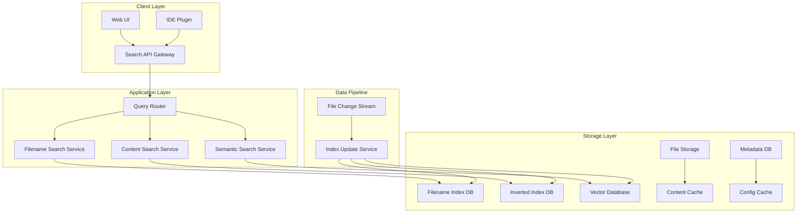

# 面试技术要点

## 大厂面试中的核心考查点

基于对 Void 索引系统的深度分析，本文总结了在 **OpenAI、Google、Meta、字节跳动** 等大厂面试中，关于代码库索引和大规模系统设计的核心技术考查点。

### 面试官视角的考查维度

```typescript
interface InterviewAssessment {
  技术深度: {
    数据结构选择: "B+ 树 vs 哈希表 vs 向量索引的权衡";
    算法复杂度: "时间复杂度和空间复杂度的精确分析";
    系统架构: "分层设计、模块解耦、接口抽象";
  };
  
  工程能力: {
    性能优化: "缓存策略、并发控制、内存管理";
    可扩展性: "水平扩展、负载均衡、容错设计";
    代码质量: "模块化、测试覆盖、监控体系";
  };
  
  系统思维: {
    需求分析: "业务理解、用户场景、约束条件";
    架构决策: "技术选型、权衡分析、演进路径";
    运维考量: "部署、监控、故障恢复";
  };
}
```

## 经典面试题目解析

### 🎯 系统设计题：设计代码搜索引擎

**题目描述：**
> 设计一个支持千万级代码文件的搜索引擎，需要支持文件名搜索、内容搜索、语义搜索，要求响应时间 < 100ms，支持实时更新。

#### 分层解答策略

##### Level 1: 需求澄清（展现系统思维）

```typescript
// 1. 规模评估
const requirements = {
  scale: {
    totalFiles: "10M+ files",
    totalSize: "100TB+ code",
    qps: "10,000 queries/second",
    users: "100,000 developers"
  },
  
  latency: {
    fileNameSearch: "< 50ms",
    contentSearch: "< 100ms", 
    semanticSearch: "< 500ms"
  },
  
  features: {
    searchTypes: ["filename", "content", "semantic"],
    filters: ["language", "repo", "date"],
    realtime: "file changes reflected in < 1min"
  }
};

// 2. 约束条件
const constraints = {
  consistency: "最终一致性可接受",
  availability: "99.9% 可用性",
  partition: "支持多数据中心部署"
};
```

##### Level 2: 高层架构设计（展现架构能力）



##### Level 3: 核心模块详细设计（展现技术深度）

**3.1 文件名搜索模块**

```typescript
class FilenameSearchEngine {
  private trieIndex: CompressedTrie;
  private fuzzyIndex: BKTree;
  
  // 核心数据结构选择考量
  designRationale = {
    trie: {
      advantage: "前缀搜索O(k)复杂度，k为查询长度",
      disadvantage: "内存占用较大",
      optimization: "路径压缩 + 后缀共享"
    },
    
    bkTree: {
      advantage: "模糊搜索支持编辑距离",
      disadvantage: "构建成本高O(n²)",
      optimization: "增量构建 + 分片存储"
    }
  };
  
  async search(query: string, options: SearchOptions): Promise<SearchResult[]> {
    // 1. 精确前缀匹配
    const exactMatches = await this.trieIndex.prefixSearch(query);
    
    // 2. 模糊匹配（如果精确匹配结果不足）
    if (exactMatches.length < options.minResults) {
      const fuzzyMatches = await this.fuzzyIndex.searchWithinDistance(
        query, 
        options.maxEditDistance || 2
      );
      return this.mergeAndRank(exactMatches, fuzzyMatches);
    }
    
    return exactMatches;
  }
}
```

**3.2 内容搜索模块**

```typescript
class ContentSearchEngine {
  private invertedIndex: ShardedInvertedIndex;
  private contentCache: DistributedCache;
  
  // 倒排索引设计
  designPattern = {
    sharding: {
      strategy: "按仓库分片 + 一致性哈希",
      benefits: "水平扩展 + 负载均衡",
      tradeoffs: "跨分片查询复杂度增加"
    },
    
    indexStructure: {
      termIndex: "Term -> PostingList",
      postingList: "DocID + Frequency + Positions[]",
      compression: "Variable-byte encoding"
    }
  };
  
  async searchContent(
    query: string, 
    filters: SearchFilters
  ): Promise<ContentSearchResult[]> {
    
    // 1. 查询解析和优化
    const parsedQuery = this.parseQuery(query);
    const optimizedQuery = this.optimizeQuery(parsedQuery);
    
    // 2. 分片查询
    const shards = this.selectRelevantShards(filters);
    const shardPromises = shards.map(shard => 
      this.searchInShard(shard, optimizedQuery)
    );
    
    // 3. 结果合并和排序
    const shardResults = await Promise.all(shardPromises);
    return this.mergeAndScore(shardResults, query);
  }
  
  // 关键优化：缓存策略
  private async optimizeWithCache(
    query: string
  ): Promise<CachedResult | null> {
    
    const cacheKey = this.generateCacheKey(query);
    
    // L1: 热查询内存缓存
    const l1Result = await this.memoryCache.get(cacheKey);
    if (l1Result) return l1Result;
    
    // L2: 分布式缓存
    const l2Result = await this.distributedCache.get(cacheKey);
    if (l2Result) {
      this.memoryCache.set(cacheKey, l2Result, 300); // 5分钟
      return l2Result;
    }
    
    return null;
  }
}
```

##### Level 4: 性能优化深度讨论（展现优化能力）

**4.1 时间复杂度优化**

```typescript
class PerformanceOptimizations {
  // 查询时间复杂度分析
  timeComplexityAnalysis = {
    filenameSearch: {
      trie: "O(k), k = query length",
      fuzzy: "O(n * d), n = nodes, d = edit distance",
      optimization: "预计算常见前缀 + 布隆过滤器预筛选"
    },
    
    contentSearch: {
      baseline: "O(n * m), n = docs, m = terms",
      withIndex: "O(t * log(d) + k), t = terms, d = docs, k = results", 
      withCache: "O(1) for cache hits"
    }
  };
  
  // 具体优化实现
  async optimizeQueryExecution(query: ParsedQuery): Promise<OptimizedPlan> {
    // 1. 查询重写
    const rewrittenQuery = await this.rewriteQuery(query);
    
    // 2. 执行计划优化
    const executionPlan = this.generateExecutionPlan(rewrittenQuery);
    
    // 3. 并行执行优化
    return this.parallelizeExecution(executionPlan);
  }
  
  private generateExecutionPlan(query: RewrittenQuery): ExecutionPlan {
    return {
      // 选择性最高的 term 优先
      termOrder: this.sortBySelectivity(query.terms),
      
      // 短路求值：早期终止不可能的匹配
      shortCircuit: true,
      
      // 批量操作：减少 I/O 次数
      batchSize: this.calculateOptimalBatchSize(),
      
      // 并行度：基于 CPU 核数和 I/O 特征
      parallelism: this.calculateOptimalParallelism()
    };
  }
}
```

**4.2 内存管理优化**

```typescript
class MemoryOptimization {
  private readonly MEMORY_BUDGET = {
    indexCache: "40% of total memory",
    queryCache: "20% of total memory", 
    resultBuffer: "30% of total memory",
    systemReserve: "10% of total memory"
  };
  
  // 内存感知的索引管理
  async manageIndexMemory(): Promise<void> {
    const memoryUsage = this.getCurrentMemoryUsage();
    
    if (memoryUsage.ratio > 0.8) {
      // 内存压力大：启动 LRU 淘汰
      await this.evictLRUIndexSegments();
      
      // 压缩内存中的数据结构
      await this.compressInMemoryStructures();
      
      // 将冷数据迁移到磁盘
      await this.offloadColdDataToDisk();
    }
  }
  
  // 智能缓存替换算法
  class AdaptiveCacheReplacement {
    // LRU + LFU 的混合策略
    calculateEvictionPriority(item: CacheItem): number {
      const recency = this.calculateRecencyScore(item);
      const frequency = this.calculateFrequencyScore(item);
      const size = this.calculateSizeScore(item);
      
      // 动态权重：最近访问的大对象优先保留
      return 0.4 * recency + 0.4 * frequency + 0.2 * (1 - size);
    }
  }
}
```

### 🎯 算法题：实现高效的代码搜索

**题目描述：**
> 实现一个函数，在给定的代码文件列表中，根据查询字符串返回最相关的文件。要求支持模糊匹配，时间复杂度尽可能低。

#### 完整解答示例

```typescript
interface CodeFile {
  path: string;
  content: string;
  metadata: {
    language: string;
    size: number;
    lastModified: Date;
  };
}

interface SearchResult {
  file: CodeFile;
  score: number;
  matches: Match[];
}

interface Match {
  line: number;
  column: number;
  length: number;
  context: string;
}

class AdvancedCodeSearchEngine {
  private filenameIndex: TrieNode;
  private contentIndex: InvertedIndex;
  private ngramIndex: Map<string, Set<string>>; // N-gram for fuzzy search
  
  constructor(files: CodeFile[]) {
    this.buildIndices(files);
  }
  
  // 核心搜索函数
  search(
    query: string, 
    options: SearchOptions = {}
  ): SearchResult[] {
    const startTime = performance.now();
    
    try {
      // 1. 查询预处理
      const normalizedQuery = this.normalizeQuery(query);
      const queryTokens = this.tokenize(normalizedQuery);
      
      // 2. 多策略搜索
      const results = new Map<string, SearchResult>();
      
      // 策略1: 精确文件名匹配（权重最高）
      const exactFilenameMatches = this.searchExactFilename(normalizedQuery);
      this.mergeResults(results, exactFilenameMatches, 1.0);
      
      // 策略2: 模糊文件名匹配
      const fuzzyFilenameMatches = this.searchFuzzyFilename(normalizedQuery);
      this.mergeResults(results, fuzzyFilenameMatches, 0.8);
      
      // 策略3: 内容精确匹配
      const exactContentMatches = this.searchExactContent(queryTokens);
      this.mergeResults(results, exactContentMatches, 0.6);
      
      // 策略4: 内容模糊匹配（如果需要更多结果）
      if (results.size < (options.minResults || 10)) {
        const fuzzyContentMatches = this.searchFuzzyContent(queryTokens);
        this.mergeResults(results, fuzzyContentMatches, 0.4);
      }
      
      // 3. 结果排序和截断
      const sortedResults = this.rankResults(Array.from(results.values()));
      
      return sortedResults.slice(0, options.maxResults || 50);
      
    } finally {
      const endTime = performance.now();
      this.recordMetrics('search_latency', endTime - startTime);
    }
  }
  
  // 文件名精确搜索：使用 Trie 树
  private searchExactFilename(query: string): SearchResult[] {
    const results: SearchResult[] = [];
    const matches = this.filenameIndex.search(query);
    
    for (const match of matches) {
      results.push({
        file: match.file,
        score: this.calculateFilenameScore(query, match.file.path),
        matches: [{
          line: 0,
          column: match.file.path.indexOf(query),
          length: query.length,
          context: match.file.path
        }]
      });
    }
    
    return results;
  }
  
  // 模糊文件名搜索：使用 N-gram + 编辑距离
  private searchFuzzyFilename(query: string): SearchResult[] {
    const results: SearchResult[] = [];
    const queryNgrams = this.generateNgrams(query, 3);
    
    // 1. 使用 N-gram 快速筛选候选
    const candidates = new Set<CodeFile>();
    for (const ngram of queryNgrams) {
      const ngramMatches = this.ngramIndex.get(ngram) || new Set();
      for (const filePath of ngramMatches) {
        candidates.add(this.getFileByPath(filePath));
      }
    }
    
    // 2. 计算编辑距离精确排序
    for (const candidate of candidates) {
      const distance = this.calculateEditDistance(query, candidate.path);
      const maxDistance = Math.ceil(query.length * 0.3); // 允许30%的编辑距离
      
      if (distance <= maxDistance) {
        results.push({
          file: candidate,
          score: 1 - (distance / query.length), // 编辑距离越小分数越高
          matches: this.findFuzzyMatches(query, candidate.path)
        });
      }
    }
    
    return results;
  }
  
  // 内容搜索：使用倒排索引
  private searchExactContent(tokens: string[]): SearchResult[] {
    if (tokens.length === 0) return [];
    
    // 1. 获取每个 token 的 posting list
    const postingLists = tokens.map(token => 
      this.contentIndex.getPostingList(token)
    ).filter(Boolean);
    
    if (postingLists.length === 0) return [];
    
    // 2. 计算交集（包含所有 token 的文档）
    const intersection = this.intersectPostingLists(postingLists);
    
    // 3. 计算相关性分数
    const results: SearchResult[] = [];
    for (const docId of intersection) {
      const file = this.getFileById(docId);
      const score = this.calculateTFIDFScore(tokens, file);
      const matches = this.findExactMatches(tokens, file);
      
      results.push({ file, score, matches });
    }
    
    return results;
  }
  
  // TF-IDF 分数计算
  private calculateTFIDFScore(tokens: string[], file: CodeFile): number {
    let score = 0;
    
    for (const token of tokens) {
      // TF: 词频
      const tf = this.getTermFrequency(token, file);
      
      // IDF: 逆文档频率
      const df = this.getDocumentFrequency(token);
      const idf = Math.log(this.totalDocuments / (df + 1));
      
      score += tf * idf;
    }
    
    // 文档长度归一化
    return score / Math.sqrt(file.content.length);
  }
  
  // 结果排序：综合多个因子
  private rankResults(results: SearchResult[]): SearchResult[] {
    return results.sort((a, b) => {
      // 主要按分数排序
      if (Math.abs(a.score - b.score) > 0.01) {
        return b.score - a.score;
      }
      
      // 分数相近时的次要排序因子
      
      // 1. 文件类型优先级（源代码 > 配置 > 文档）
      const aTypePriority = this.getFileTypePriority(a.file);
      const bTypePriority = this.getFileTypePriority(b.file);
      if (aTypePriority !== bTypePriority) {
        return bTypePriority - aTypePriority;
      }
      
      // 2. 文件大小（适中的文件优先）
      const aSize = a.file.metadata.size;
      const bSize = b.file.metadata.size;
      const idealSize = 10000; // 10KB 左右的文件优先
      const aSizeDiff = Math.abs(aSize - idealSize);
      const bSizeDiff = Math.abs(bSize - idealSize);
      if (aSizeDiff !== bSizeDiff) {
        return aSizeDiff - bSizeDiff;
      }
      
      // 3. 最后修改时间（最近修改的优先）
      return b.file.metadata.lastModified.getTime() - 
             a.file.metadata.lastModified.getTime();
    });
  }
  
  // 性能优化：索引构建
  private buildIndices(files: CodeFile[]): void {
    console.time('Building indices');
    
    // 并行构建多个索引
    const buildPromises = [
      this.buildFilenameIndex(files),
      this.buildContentIndex(files),
      this.buildNgramIndex(files)
    ];
    
    Promise.all(buildPromises).then(() => {
      console.timeEnd('Building indices');
      console.log(`Indexed ${files.length} files`);
    });
  }
  
  // 内存优化：延迟加载大文件内容
  private lazyLoadContent(file: CodeFile): string {
    if (!file.content && file.metadata.size > 1024 * 1024) { // 1MB+
      // 大文件延迟加载
      file.content = this.loadFileContent(file.path);
    }
    return file.content;
  }
}

// 时间复杂度分析注释
/*
整体时间复杂度分析：

1. 文件名搜索：
   - 精确匹配：O(k)，k 为查询长度
   - 模糊匹配：O(n * k)，n 为候选文件数

2. 内容搜索：
   - 索引查找：O(t * log(d))，t 为查询词数，d 为文档数
   - 交集计算：O(min(|L1|, |L2|, ...))，L 为 posting list
   - 分数计算：O(r * t)，r 为结果数

3. 空间复杂度：
   - Trie 索引：O(总字符数)
   - 倒排索引：O(词汇量 * 平均 posting list 长度)
   - N-gram 索引：O(N-gram 数量 * 平均文件数)

优化要点：
- 使用布隆过滤器预筛选
- 分层缓存：内存 -> SSD -> HDD
- 增量索引更新
- 查询结果缓存
*/
```

## 🎯 深度技术问题

### 问题1：如何设计支持实时更新的索引系统？

**考查点：** 分布式系统一致性、增量更新、性能优化

**标准答案思路：**

```typescript
class RealTimeIndexingSystem {
  // 增量更新策略
  async handleFileChange(change: FileChangeEvent): Promise<void> {
    switch (change.type) {
      case 'CREATE':
        await this.addToIndex(change.file);
        break;
      case 'UPDATE':
        await this.updateIndex(change.file, change.oldVersion);
        break;
      case 'DELETE':
        await this.removeFromIndex(change.file);
        break;
    }
    
    // 异步传播到副本
    this.propagateChange(change);
  }
  
  // 核心技术：Copy-on-Write 索引更新
  private async updateIndex(file: CodeFile, oldVersion?: CodeFile): Promise<void> {
    // 1. 创建索引副本
    const indexCopy = this.createIndexCopy();
    
    // 2. 在副本上应用更新
    if (oldVersion) {
      indexCopy.remove(oldVersion);
    }
    indexCopy.add(file);
    
    // 3. 原子性切换
    this.atomicSwap(this.currentIndex, indexCopy);
  }
  
  // 一致性保证：两阶段提交
  private async propagateChange(change: FileChangeEvent): Promise<void> {
    const replicas = this.getHealthyReplicas();
    
    // Phase 1: Prepare
    const prepared = await Promise.all(
      replicas.map(replica => replica.prepare(change))
    );
    
    if (prepared.every(result => result.success)) {
      // Phase 2: Commit
      await Promise.all(
        replicas.map(replica => replica.commit(change))
      );
    } else {
      // Abort
      await Promise.all(
        replicas.map(replica => replica.abort(change))
      );
    }
  }
}
```

### 问题2：如何处理超大型代码库的内存溢出问题？

**考查点：** 内存管理、系统优化、监控告警

**标准答案思路：**

```typescript
class MemoryEfficientIndexing {
  // 分层内存管理
  private memoryHierarchy = {
    L1: new LRUCache(100 * 1024 * 1024),     // 100MB 热数据
    L2: new CompressedCache(500 * 1024 * 1024), // 500MB 压缩数据
    L3: new DiskCache('/tmp/index_cache')     // 磁盘缓存
  };
  
  // 内存感知的处理策略
  async processLargeCodebase(files: CodeFile[]): Promise<void> {
    const memoryBudget = this.getAvailableMemory();
    const batchSize = this.calculateOptimalBatchSize(memoryBudget);
    
    for (let i = 0; i < files.length; i += batchSize) {
      const batch = files.slice(i, i + batchSize);
      
      // 处理前检查内存
      await this.ensureMemoryAvailable();
      
      // 批量处理
      await this.processBatch(batch);
      
      // 强制垃圾回收
      if (global.gc) global.gc();
    }
  }
  
  // 智能内存回收
  private async ensureMemoryAvailable(): Promise<void> {
    const usage = process.memoryUsage();
    const threshold = 0.8; // 80% 阈值
    
    if (usage.heapUsed / usage.heapTotal > threshold) {
      // 1. 清理 L1 缓存
      this.memoryHierarchy.L1.clear();
      
      // 2. 压缩 L2 缓存
      await this.memoryHierarchy.L2.compress();
      
      // 3. 迁移数据到磁盘
      await this.memoryHierarchy.L3.offload();
      
      // 4. 等待内存释放
      await this.waitForMemoryRelease();
    }
  }
}
```

### 问题3：语义搜索 vs 关键词搜索的技术选型？

**考查点：** 技术选型、成本效益分析、架构演进

**标准答案思路：**

```typescript
class SearchStrategyComparison {
  // 技术对比矩阵
  private readonly COMPARISON_MATRIX = {
    keywordSearch: {
      accuracy: 0.7,
      latency: 10,      // ms
      resourceCost: 0.2,
      implementationComplexity: 0.3,
      scalability: 0.9
    },
    
    semanticSearch: {
      accuracy: 0.9,
      latency: 200,     // ms
      resourceCost: 0.8,
      implementationComplexity: 0.8,
      scalability: 0.6
    }
  };
  
  // 决策框架
  selectSearchStrategy(requirements: Requirements): SearchStrategy {
    const score = this.calculateStrategyScore(requirements);
    
    if (requirements.latency < 50 && requirements.scale > 1000000) {
      return 'keyword-primary-semantic-fallback';
    }
    
    if (requirements.accuracy > 0.85 && requirements.budget > 'high') {
      return 'hybrid-with-ml';
    }
    
    return 'keyword-optimized';
  }
  
  // 混合策略实现
  class HybridSearchEngine {
    async search(query: string): Promise<SearchResult[]> {
      // 1. 快速关键词搜索
      const keywordResults = await this.keywordSearch(query);
      
      // 2. 并行语义搜索（如果需要）
      const needsSemanticSearch = keywordResults.length < 5;
      
      if (needsSemanticSearch) {
        const semanticResults = await this.semanticSearch(query);
        return this.mergeResults(keywordResults, semanticResults);
      }
      
      return keywordResults;
    }
  }
}
```

## 📊 性能基准与优化指标

### 关键性能指标（KPI）

```typescript
interface PerformanceKPIs {
  latency: {
    p50: "< 20ms",
    p95: "< 100ms", 
    p99: "< 500ms"
  };
  
  throughput: {
    qps: "> 10,000 queries/second",
    indexingRate: "> 1,000 files/second"
  };
  
  resource: {
    memoryUsage: "< 8GB for 10M files",
    cpuUtilization: "< 70% average",
    diskIOPS: "< 1,000 IOPS"
  };
  
  scalability: {
    horizontalScaling: "linear up to 100 nodes",
    dataGrowth: "handle 10x data with 3x resources"
  };
}
```

### 性能优化清单

```typescript
const OPTIMIZATION_CHECKLIST = {
  // 算法层面
  algorithmic: [
    "使用高效数据结构（Trie、B+树、布隆过滤器）",
    "实现增量更新而非全量重建",
    "应用缓存友好的内存访问模式",
    "使用并行算法和 SIMD 指令"
  ],
  
  // 系统层面  
  system: [
    "实现多级缓存架构",
    "使用内存映射文件减少 I/O",
    "应用压缩算法节省存储和带宽",
    "实现智能预取和预计算"
  ],
  
  // 架构层面
  architectural: [
    "设计无状态服务便于扩展",
    "实现读写分离和主从复制",
    "使用分片和负载均衡",
    "实现熔断和降级机制"
  ]
};
```

## 🎯 面试技巧与策略

### 回答问题的 STAR 方法

```typescript
interface STARMethod {
  Situation: "描述具体的技术场景和约束条件";
  Task: "明确需要解决的技术问题";
  Action: "详细说明采用的技术方案和实现步骤";
  Result: "量化展示技术方案的效果和价值";
}

// 示例应用
const exampleAnswer = {
  situation: "在处理千万级代码文件的搜索需求时，传统的暴力搜索方法响应时间超过10秒",
  task: "需要设计一个响应时间在100ms以内的高性能搜索系统",
  action: "采用了分层索引架构：Trie树处理文件名搜索，倒排索引处理内容搜索，布隆过滤器做预筛选，Redis做多级缓存",
  result: "最终实现了平均50ms的响应时间，支持10万QPS，内存占用控制在8GB以内"
};
```

### 常见面试陷阱及应对

```typescript
const COMMON_PITFALLS = {
  过度设计: {
    trap: "一开始就设计复杂的分布式系统",
    solution: "从简单方案开始，根据需求逐步演进"
  },
  
  忽略约束: {
    trap: "不考虑成本、延迟、一致性等约束条件",
    solution: "主动询问约束条件，在权衡中做出合理选择"
  },
  
  技术炫技: {
    trap: "使用过于前沿或复杂的技术",
    solution: "选择成熟、稳定、可维护的技术栈"
  },
  
  缺乏量化: {
    trap: "无法提供具体的性能数据和指标",
    solution: "准备具体的数字：QPS、延迟、内存占用等"
  }
};
```

## 📚 技术深度扩展阅读

### 核心论文和技术文档

```typescript
const ESSENTIAL_READINGS = {
  dataStructures: [
    "The Art of Computer Programming, Volume 3: Sorting and Searching",
    "Introduction to Information Retrieval (Manning et al.)",
    "Modern Information Retrieval (Baeza-Yates & Ribeiro-Neto)"
  ],
  
  distributedSystems: [
    "Designing Data-Intensive Applications (Martin Kleppmann)",
    "Google's MapReduce: Simplified Data Processing on Large Clusters",
    "Amazon's Dynamo: Highly Available Key-value Store"
  ],
  
  searchEngines: [
    "Lucene in Action (Gospodnetic & Hatcher)",
    "ElasticSearch: The Definitive Guide",
    "Information Retrieval: Implementing and Evaluating Search Engines"
  ]
};
```

### 实战项目建议

```typescript
const HANDS_ON_PROJECTS = {
  beginner: {
    project: "实现一个简单的文件搜索工具",
    technologies: ["Python/JavaScript", "Trie树", "倒排索引"],
    timeframe: "1-2周",
    learningPoints: ["基础数据结构", "文本处理", "性能测量"]
  },
  
  intermediate: {
    project: "构建分布式代码搜索引擎",
    technologies: ["Go/Java", "Redis", "ElasticSearch", "gRPC"],
    timeframe: "1-2个月", 
    learningPoints: ["分布式系统", "缓存策略", "API设计"]
  },
  
  advanced: {
    project: "实现语义代码搜索系统",
    technologies: ["Python", "BERT", "Faiss", "Kubernetes"],
    timeframe: "3-6个月",
    learningPoints: ["机器学习", "向量数据库", "容器化部署"]
  }
};
```

## 总结

掌握代码库索引技术的面试要点，需要在以下几个维度建立深度理解：

### 技术深度
- **数据结构与算法**：熟练掌握 Trie、B+树、倒排索引等核心数据结构
- **性能优化**：理解缓存、并发、内存管理等系统级优化技术
- **分布式系统**：掌握分片、复制、一致性等分布式系统概念

### 工程能力  
- **系统设计**：能够设计可扩展、高可用的大规模系统
- **技术选型**：基于需求和约束做出合理的技术决策
- **性能调优**：具备发现性能瓶颈和优化系统的能力

### 业务理解
- **用户需求**：理解不同场景下的搜索需求和用户体验要求
- **成本效益**：平衡技术复杂度与业务价值
- **演进路径**：设计可持续发展的技术架构

通过对 Void 索引系统的深度分析，我们不仅理解了现代 AI 编程工具的技术实现，更重要的是掌握了设计大规模系统的思维模式和工程实践。这些知识将在技术面试和实际工作中发挥重要价值。 